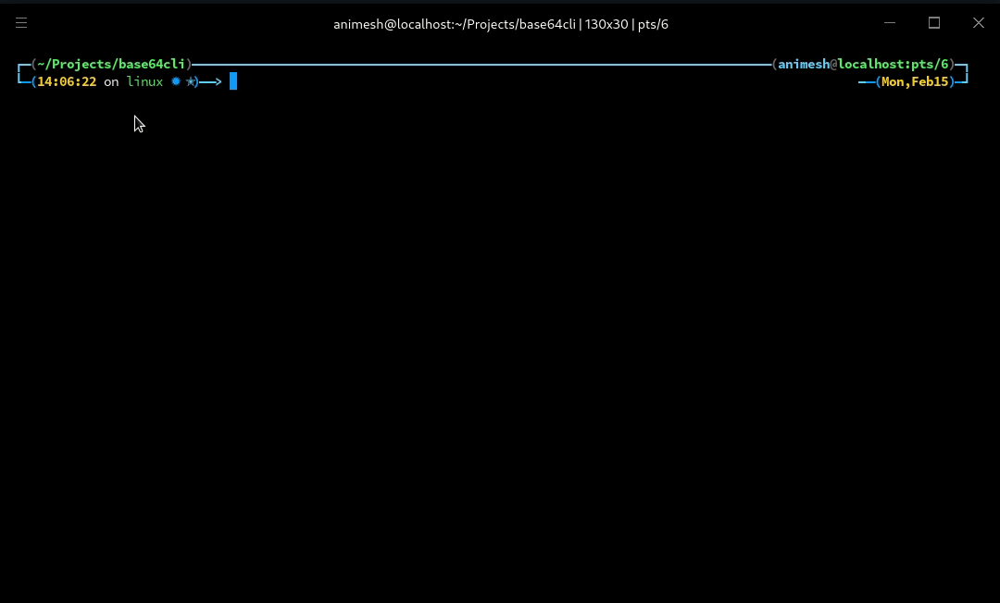

# Base 64 Command Line Interface

A very short command line interface for encoding and decoding base64 messages.

# Usage

## Script
	- For encoding
		python b64cli.py --encode "Some String"

	- For decoding
		python b64cli.py --decode "VGhpcyBpcyBzb21lIHN0cmluZw=="

	- Without copying to clipboard
		python b64cli.py --encode "Some string you don't want copied" --copy False | no | n | 0

# Setup 

- This code runs using Pyperclip for copying the output on paperclip.
- Depending on the OS, it would use pyperclip's backend dependencies.

## Installation

- For linux systems, copy the dist/b64cli to /usr/bin/b64cli for system-wide installation.

## Building from source

- For building from source, you'd need a python environment with following third party packages
	- Pyperclip
	- Pyinstaller

- Test the script once by running b64cli.py with appropriate arguments

- Run the following command from terminal
	
		pyinstaller b64cli.py

# To-do

- Build for Windows systems

- Write a setup script
